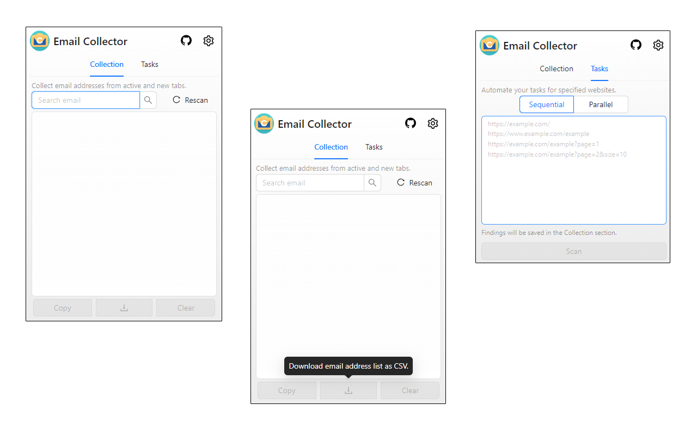

# Chrome Email Collector Extension

Chrome extension that helps you collect email addresses from web pages efficiently.

## Features

- **Smart Email Collection**:
  - Collects emails from active tab content
  - Supports dynamic content (AJAX, SPA)
  - Handles HTML attributes (aria-label, title, data-\*)
  - RFC 5322 compliant email validation
- **Batch Processing**:
  - Sequential or parallel website scanning
  - Configurable batch sizes
  - Progress tracking
  - Cancellable operations
- **User Interface**:
  - Clean, modern design with Ant Design
  - Real-time search filtering
  - Copy to clipboard functionality
  - CSV export option
  - Loading indicators
  - Error handling with user feedback

## Privacy Policy

Our privacy policy can be found at: [PRIVACY_POLICY.md](PRIVACY_POLICY.md) or [here](https://buraketmen.github.io/email-collector/)

## License

This project is licensed under the MIT License.

## Acknowledgments

- [Ant Design](https://ant.design/) for UI components
- [React](https://reactjs.org/) for UI development
- [Chrome Extensions API](https://developer.chrome.com/docs/extensions/) for browser integration
